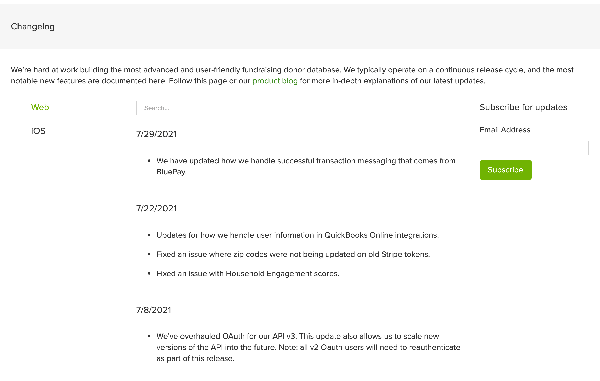

## Overview

I have completed various small projects for Bloomerang's <a href="https://bloomerang.co/" target="_blank" rel="noopener">marketing site</a>, including a custom video player for the Bloomerang Academy landing page and a custom changelog solution.

## Technologies & Skills

- CSS Grid and Flexbox
- JavaScript
- UX Design
- Responsive Web Design
- WordPress CMS

## Bloomerang Academy

Bloomerang <a href="https://bloomerang.co/" target="_blank" rel="noopener">Academy</a> is a bi-weekly webinar for Bloomerang customers to learn about features and best practices. Bloomerang's marketing site maintains a page for class registration and an archive of previous classes. For this project, I created a custom video player for viewing those previous classes.

## Bloomerang Changelog

I created a custom 3 column layout with a toggle menu to access <a href="https://bloomerang.co/features/changelog" target="_blank" rel="noopener">changelog updates</a> to the Bloomerang web application and for Bloomerang's iOS application. I also create a custom search input field for finding specific entries in the changelog.

