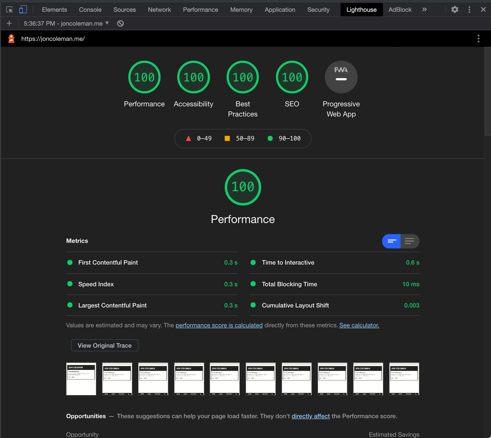

## Overview

This website was designed in [Figma](https://www.figma.com/) and built with [Gatsby](https://www.gatsbyjs.com/). I really wanted to create something that showcases my personality, while existing comfortably at the crossroads between accessibility, aesthetics, and performance.

## Details

These are the areas I focused on when I set out to create this site:

### Accessibility

I really wanted to take a look at all of the ways in which we can create accessible experiences online and apply them as best as I am able to this site. Given that perspective, I did the following:

- I created an intentionally high contrast design in Figma (luckily enough, I think it fits my personality too).
- I paid close attention to focus styles and functionality throughout the site. Try tabbing through the links.
- I wrote all of my components using semantic HTML, in the hopes that screen reader functionality is operating at 💯.
- Using a React hook, I implemented dark mode. It should recognize your system preferences and set the theme accordingly, but you can of course toggle the styles.

Outside of these considerations, Gatsby really makes accessibility a breeze because many features are baked right in when you compile the project.

### Performance

I knew from the beginning that I was not going to be piping in loads of API data or doing much heavy lifting on this site internally, but I think building on the JAMstack was still a great decision because this site is very performant. Fast load times and efficient image processing are big wins for UX in my book.
